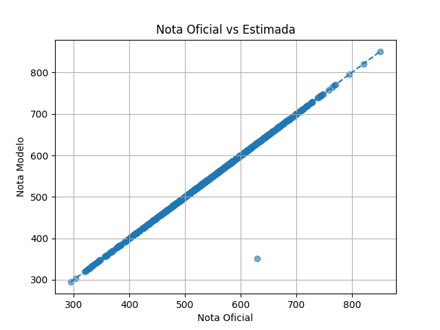

# Calculadora ENEM

Caso queira apenas calcular sua nota no ENEM use o site [pedro-mantovani.github.io/site_calculadora_ENEM/](https://pedro-mantovani.github.io/site_calculadora_ENEM/).

## Sumário

* [Sobre o projeto](#sobre-o-projeto)
* [Resultados](#resultados)
* [Estrutura do repositório](#estrutura-do-repositório)
* [Instalação](#instalação)
* [Uso rápido](#uso-rápido)
* [Exemplo de uso](#exemplo-de-uso)
* [Como funciona o cálculo](#como-funciona-o-cálculo)

  * [Modelagem das questões](#1-modelagem-das-questões)
  * [Cálculo da proficiência (θ)](#2-cálculo-da-proficiência-θ)
  * [Conversão para a escala do ENEM](#3-conversão-para-a-escala-do-enem)
* [Casos atípicos e inconsistências nos microdados](#casos-atípicos-e-inconsistências-nos-microdados)

  * [Provas com inconsistências estruturais](#provas-com-inconsistências-estruturais)
  * [Participantes atípicos](#participantes-atípicos)
* [Dados utilizados](#dados-utilizados)
* [Códigos extras](#códigos-extras)
* [Limitações](#limitações)
* [Reprodutibilidade](#reprodutibilidade)
* [Referências](#referências)
* [Contribuição](#contribuição)

---

# Sobre o projeto

Este projeto implementa uma abordagem reproduzível para estimar notas do ENEM utilizando Python e os microdados públicos disponibilizados pelo INEP.

A metodologia utiliza:

* Teoria de Resposta ao Item (TRI);
* modelo logístico de 3 parâmetros (3PL);
* estimação de proficiência via EAP (*Expected a Posteriori*).

A implementação foi construída a partir dos procedimentos metodológicos divulgados pelo INEP e consegue reproduzir as notas oficiais com alta fidelidade utilizando apenas:

* parâmetros psicométricos dos itens;
* vetor de respostas do participante.

---

# Resultados

Nos experimentos realizados entre 2009 e 2025:

* erro médio absoluto (MAE): ~0,02 pontos;
* mediana do erro: ~0,004 pontos;
* viés próximo de zero;
* alta estabilidade entre anos e áreas.

Isso indica que a metodologia consegue reproduzir o comportamento do sistema oficial com excelente aproximação para fins educacionais e analíticos.

---

# Estrutura do repositório

```text
.
├── calculadora.py
├── dados/
├── imagens/
├── codigos_extras/
├── README.md
```

## Pastas

### `dados/`

Contém:

* parâmetros dos itens;
* códigos de prova;
* métricas de desempenho;
* arquivos auxiliares para reprodução dos experimentos.

### `imagens/`

Gráficos e figuras utilizados na documentação.

### `codigos_extras/`

Scripts auxiliares utilizados nos experimentos e análises.

---

# Instalação

## 1. Clonar o repositório

```bash
git clone https://github.com/pedro-mantovani/calculadora_ENEM
```

## 2. Instalar dependências

```bash
pip install pandas numpy matplotlib
```

---

# Uso rápido

## Executar a calculadora

```bash
python3 calculadora.py
```

Note que para o programa espera o caminho `dados/ITENS_PROVAS/ITENS_PROVA_{ano}.csv` para os dados do item das provas, altere se necessário.

O programa solicitará:

* ano da prova;
* código da prova;
* respostas do participante.

O sistema retornará:

* número de acertos;
* proficiência estimada (θ);
* nota final estimada.

---

# Exemplo de uso

## Entrada

```text
Ano: 2024
Código da prova: 1420

1. A
2. B
...
45. A
```

## Saída

```text
Acertos: 35
Theta: 1.1929388941456571
Nota: 654.7
```

---
## Como funciona o cálculo

O cálculo da nota do ENEM é baseado na **Teoria de Resposta ao Item (TRI)**, que considera não apenas o número de acertos, mas também a coerência das respostas.

A seguir está uma explicação da metodologia utilizada.

---

### 1. Modelagem das questões

Cada questão é modelada por três parâmetros:

* **a (discriminação):** capacidade de diferenciar alunos com diferentes níveis de habilidade
* **b (dificuldade):** nível de proficiência necessário para acertar a questão
* **c (acerto ao acaso):** probabilidade de acerto por chute

Esses parâmetros definem a **Curva Característica do Item (CCI)**:

$$
P(\theta) = c + \frac{1 - c}{1 + e^{-a(\theta - b)}}
$$


**Interpretação:**

* Quanto maior o θ, maior a probabilidade de acerto
* Questões mais difíceis (b alto) deslocam a curva para a direita

* Alta discriminação (a alto) torna a curva mais inclinada

* Maior acerto ao acaso (c alto) eleva a base da curva


---

### 2. Cálculo da proficiência (θ)

O objetivo é estimar a proficiência do aluno (θ), que representa sua habilidade.

---

#### 2.1 Função de verossimilhança (MLE)

Dado um conjunto de respostas, calcula-se a probabilidade de um aluno com determinada proficiência produzir aquele padrão.

Isso é feito multiplicando:

* Probabilidades de acerto nas questões corretas
* Probabilidades de erro nas questões incorretas

O valor de θ que maximiza essa função é chamado de **MLE (Maximum Likelihood Estimation)**.

**Limitação:**
Se o aluno acerta todas as questões, a estimativa tende ao infinito.

---

#### 2.2 Método EAP (Expected a Posteriori)

Para evitar esse problema, utiliza-se o método EAP.

Nesse método:

* Assume-se que θ segue uma distribuição normal padrão (média 0, desvio 1)
* Essa distribuição atua como uma **priori**, penalizando valores extremos

A função utilizada é:

$$
\pi(\theta) = \frac{e^{-\theta^2/2}}{\sqrt{2\pi}}
$$

A estimativa final é baseada na **distribuição a posteriori**, que combina:

* Evidência dos dados (respostas)
* Conhecimento prévio (distribuição normal)

Simplificando, é como se essa função amarrasse uma corda e não deixasse a proficiência do aluno ser muito alta, visto que isso é pouco provável. Assim, quanto mais longe do esperado mais esses valores são penalizados e quanto mais perto do esperado mais próximos são os resultados de ambos os métodos.

O último passo é encontrar o centro de massa desta nova função. Usar o centro de massa ao invés do valor máximo permite levar em consideração para onde o gráfico tende além de simplesmente ver o ponto máximo da função. Repare na diferença prática dos dois métodos:


---

#### 2.3 Aproximação numérica

O centro de massa é calculado por:

$$
CM = \frac{\int x f(x),dx}{\int f(x),dx}
$$

Como não há solução analítica simples, utiliza-se aproximação numérica:

* Intervalo considerado: [-4, 4]
* Divisão em 400 pontos
* Cálculo da função em cada ponto
* Aproximação da integral via método dos trapézios
* Cada par de pontos forma um trapézio de base $f(x_{i})$ e $f(x_{i+1})$
* Somando as áreas de todos os trapézios temos aproximadamente a área do gráfico

Essa abordagem oferece um bom equilíbrio entre precisão e desempenho.

**Observação:**
O INEP utiliza quadratura gaussiana, que é mais precisa, porém menos didática.

---

#### 2.4 Otimização com logaritmos

Para evitar problemas numéricos (como underflow), os cálculos são feitos em escala logarítmica:

* Produtos → somas
* Maior estabilidade computacional

---

# 3. Conversão para a escala do ENEM

Após a estimação de θ:

$$
\text{Nota} = \mu + \sigma \theta
$$

Esses parâmetros não são divulgados oficialmente pelo INEP apenas o valor aproximado de 500 para $\mu$ e 100 para $\sigma$.

Porém, ao aplicar uma regressão linear entre os valores estimados da proficiência e a nota final oficial, é possível encontrar os valores aproximados apresentados na tabela:

## Valores médios estimados

| Área                 | $\mu$   | $\sigma$|
| -------------------- | ------- | ------- |
| Linguagens           | 499.977 | 108.091 |
| Ciências Humanas     | 501.487 | 112.315 |
| Ciências da Natureza | 501.141 | 113.108 |
| Matemática           | 500.015 | 129.654 |

Comparando as provas de 2009 a 2024 a variação média por área desses parâmetros foi próxima de 0,003 o que indica que os parâmetros são fixos por área entre os anos.

Todas as estimativas estão disponíveis no arquivo [estimativas.csv](dados/estimativas.csv)

---

# Casos atípicos e inconsistências nos microdados

Durante os experimentos foram identificadas inconsistências estruturais em subconjuntos específicos dos microdados do ENEM.

Esses casos produzem erros elevados mesmo quando a implementação está correta.

---

## Provas com inconsistências estruturais

Em alguns conjuntos de provas, foi observada uma combinação de forte viés negativo e erro médio na casa das dezenas de pontos, contrastando com o erro médio inferior a 0,03 ponto verificado na maioria dos casos.

A análise detalhada de um desses casos revelou uma despadronização no formato de exibição das respostas, comprometendo a correspondência entre o gabarito e as alternativas indicadas pelo participante.

Um desses casos ocorreu nas provas de Linguagens entre 2015 e 2021. Diferentemente das demais provas, que exibiam apenas as 45 respostas efetivamente respondidas pelo participante, essas provas também apresentavam uma sequência de cinco noves (“99999”) representando a língua estrangeira não escolhida.

Nesse cenário, o código funcionava corretamente, porém a correspondência entre as respostas corretas e as respostas do participante ficava comprometida, tornando os acertos praticamente aleatórios e acarretando a subestimação das notas.

Após a remoção dos “99999” das respostas dos participantes, o erro retornou ao patamar esperado, em torno de 0,03 ponto. Dessa forma, outras provas com tendências semelhantes foram desconsideradas da análise final, por possivelmente conterem inconsistências nos itens ou participantes que não representam adequadamente o método, nesses casos o ideial é uma revisão sistemática das provas a fim de entender se o problema está na forma de representação dos participantes ou dos itens, no segundo caso uma estimativa no [site](https://pedro-mantovani.github.io/site_calculadora_ENEM/) também apresentará inconsistências.

Outro caso identificado foi o gabarito incorreto do item 158737 (item presente nas provas de reaplicação de 2025, item 18 da prova branca), ao alterar o gabarito de B para D (assim como nos gabaritos oficiais do exame) o erro médio caiu da casa das dezenas de pontos para os centésimos.

Visto que cada caso é particular e o esforço para verificar cada prova suspeita individualmente seria muito maior que os ganhos, escolhi desconsiderar essas provas da análise final. Das 603 provas analisadas, 56 foram desconsideradas e estão apresentadas na tabela a seguir. Seus resultados estão em [dados/provas_desconsideradas.csv](dados/provas_desconsideradas.csv):

| Ano | Área | Tipo | Código(s) |
| --- | --- | --- | --- |
| 2021 | LC | Adaptada | 896 |
| 2021 | LC | Videoprova | 897 |
| 2020 | LC | Digital | 691 a 694 |
| 2019 | MT | Todos | 515 a 518, 522 e 526 |
| 2018 | CN | Todos | 447 a 450, 463 e 467 |
| 2017 | CN | Regular | 391 a 394 |
| 2017 | CN | Adaptada | 407 |
| 2017 | CH | Primeira Aplicação | 395 a 398, 408 e 412 |
| 2017 | LC | Videoprova | 417 |
| 2017 | MT | Regular | 403 a 406 |
| 2017 | MT | Adaptada | 410 |
| 2016 | CN | Reaplicação | 331 a 333, 351 a 354 |
| 2015 | CN | Adaptada | 252 |
| 2014 | LC | Reaplicação | 213 |
| 2013 | Todas | Ledor | 188, 187, 189 e 190 |
| 2013 | MT | Regular | 179 a 182 |
| 2011 | CN | Todos | 121 a 124 |

*Legenda/Legenda da tabela:* **Tabela 1: Provas desconsideradas por inconsistências sistemáticas**

---

## Participantes atípicos

Também foram identificados participantes com erros elevados, em particular, destaca-se um caso na edição de 2010, no qual um único participante apresentou erro de 279,32 pontos na prova de Ciências Humanas e 171,19 pontos na prova de Ciências da Natureza, enquanto os demais candidatos exibiram erros compatíveis com o padrão observado.



Observando o padrão de respostas desse participante, há indicios de que o código da prova do participante estão incorretos e as respostas de Humanas e Natureza estão invertidas.

Estimando a nota de Humanas usando as respostas de Natureza e o código de prova 86 (CH- Amarela) o erro cai de 279,32 para 0,03 pontos. Antálogamente, usando as respostas de Humanas com o código 90 (CN - Amarela) o erro cai de 171,19 pontos para 0,04.

Ademais, os códigos originais (101 e 105) são referentes à prova azul de reaplicação, o que não faz sentido visto que sua prova de LC e MT são da primeira aplicação.

Contudo, casos assim são isolados e difíceis de identificar, por isso, eles não foram tratados ou removidos dos dados.

---

# Dados utilizados

Os dados utilizados receberam o seguinte tratamento:

* Exclusão de participantes com nota zero

* Exclusão de colunas desnecessárias (usadas apenas as colunas de nota, respostas, código da prova e língua)

* Formato csv com separador e encoding padrão

* Remoção da substring "99999" das respostas de LC de 2015 a 2021

* Prova de 2009 não abre com a engine padrão do Pandas e não tem língua estrangeira, para resolver esse problema foi adicionado nos itens e na prova original a coluna TP_LINGUA, com valor padrão 0 (equivalente a uma prova de inglês), assim é possível estimar as notas de 2009 sem alterar o código.

Todos os dados padronizados estão disponíveis na plataforma [Zenodo](https://doi.org/10.5281/zenodo.20130840)

---

# Códigos extras

## `cci.py`

Gera gráficos da Curva Característica do Item (CCI).

---

## `EAPxMLE.py`

Compara estimativas EAP e MLE.

---

## `controler.py`

Executa avaliações em massa e calcula métricas de desempenho.

---

## `paralelo.py`

Executa avaliações em massa e calcula métricas de desempenho processando as provas em paralelo.

---

## `extracao.py`

Extrai participantes dos microdados.

---

## `proficiencia.py`

Estima proficiências individuais ou em lote.

---

## `regressao.py`

Estima os parâmetros lineares da escala do ENEM e métricas de avaliação.

---

## `filtrar_provas.py`

Filtra as provas de um determinado ano que possuem itens

---

# Limitações

Este projeto não reproduz exatamente o sistema oficial do INEP.

As principais diferenças incluem:

* uso de aproximação numérica simplificada;
* estimação empírica dos parâmetros de escala;
* ausência dos softwares oficiais utilizados pelo INEP;
* possíveis inconsistências presentes nos microdados públicos.

Apesar disso, os resultados obtidos apresentam excelente aproximação prática.

---

# Reprodutibilidade

O projeto disponibiliza:

* código-fonte;
* métricas;
* dados tratados;
* scripts de análise;
* gráficos;
* metodologia completa.

O objetivo é facilitar:

* auditoria;
* replicação;
* estudos sobre TRI;
* desenvolvimento de simuladores educacionais.

---

# Referências

* [*Entenda sua nota do ENEM*](https://download.inep.gov.br/publicacoes/institucionais/avaliacoes_e_exames_da_educacao_basica/entenda_a_sua_nota_no_enem_guia_do_participante.pdf) 

* [*ENEM: procedimentos de análise*](https://download.inep.gov.br/publicacoes/institucionais/avaliacoes_e_exames_da_educacao_basica/enem_procedimentos_de_analise.pdf)

* [INEP — Microdados ENEM](https://www.gov.br/inep/pt-br/acesso-a-informacao/dados-abertos/microdados/enem)

---

# Contribuição

Contribuições são bem-vindas.

Você pode:

* abrir issues;
* sugerir melhorias;
* enviar pull requests;
* reportar inconsistências nos microdados.