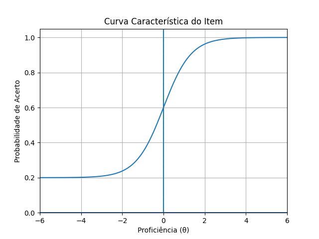
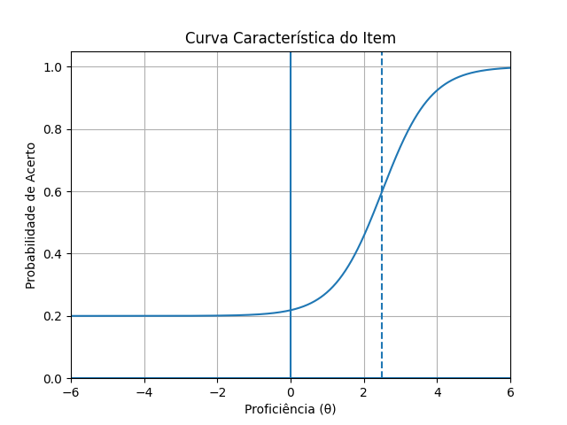
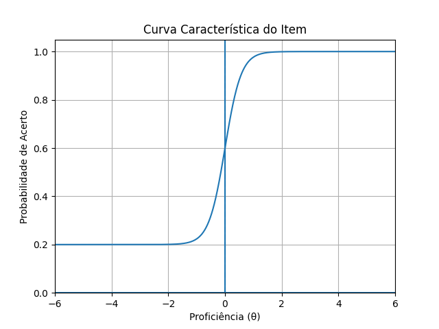
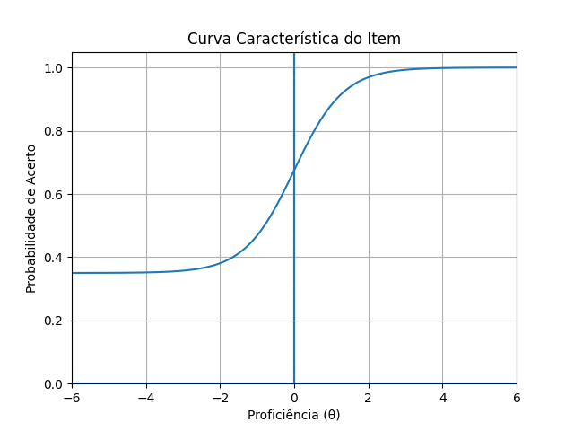
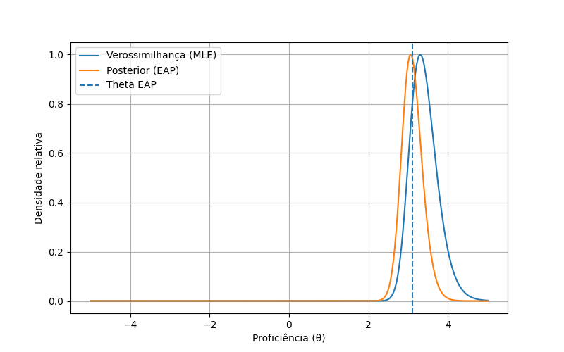

# Como calcular sua nota do ENEM

## Introdução

Este projeto tem como objetivo calcular, utilizando Python, a nota de um aluno em uma edição do ENEM a partir dos microdados divulgados pelo INEP.

O cálculo segue os métodos descritos nos documentos oficiais:

* [*Entenda sua nota do ENEM*](https://download.inep.gov.br/publicacoes/institucionais/avaliacoes_e_exames_da_educacao_basica/entenda_a_sua_nota_no_enem_guia_do_participante.pdf)
* [*ENEM: procedimentos de análise*](https://download.inep.gov.br/publicacoes/institucionais/avaliacoes_e_exames_da_educacao_basica/enem_procedimentos_de_analise.pdf)

Algumas simplificações foram aplicadas e estão detalhadas na seção [Como funciona o cálculo](#como-funciona-o-cálculo).

Nos testes realizados, o erro médio foi de aproximadamente **0,04 pontos**, indicando alta fidelidade na reprodução do cálculo oficial. Pequenas diferenças podem ser atribuídas a aproximações numéricas e simplificações do modelo.

Os dados tratados dos participantes estão disponibilizados em: [10.5281/zenodo.20130840](https://doi.org/10.5281/zenodo.20130840)

E são adaptados dos microdados oficiais disponíveis em: https://www.gov.br/inep/pt-br/acesso-a-informacao/dados-abertos/microdados/enem

---

## Utilização

### Cálculo da nota individual

### 1. Baixar o código

Baixe o arquivo [calculadora.py](calculadora.py)

---

### 2. Instalar as dependências

```bash
pip install pandas numpy
```

---

### 3. Baixar os dados dos itens

Para facilitar o uso, todas as planilhas referentes aos itens foram organizadas na pasta [dados](dados).

Você pode:

* Baixar o arquivo correspondente à prova desejada e colocá-lo na mesma pasta do projeto
  **ou**
* Obter os dados diretamente nos microdados do ENEM disponíveis no site do INEP

---

### 4. Executar o código

Execute o programa com:

```bash
python3 calculadora.py
```

O programa solicitará:

* Ano da prova
* Código da prova (disponível no dicionário dos microdados ou condensados na planilha [codigos_provas](dados/codigos_provas.ods), disponível na pasta [dados](dados))
* Suas respostas

Com essas informações, o sistema calculará:

* Número de acertos
* Proficiência estimada (θ)
* Nota final

---

## Exemplo de uso

**Entrada:**

```
Ano: 2024  
Código da prova: 1420  
Respostas: 
1. A 
2. B...
45. A
```

**Saída:**

```
Acertos: 35
Theta: 1.1929388941456571
Nota: 654.68
```

---

### Códigos extras

A pasta [codigos_extras](/codigos_extras/) compila diversos códigos úteis para replicabilidade do projeto e entendimento do cálculo da nota do ENEM.

- cci.py: permite criar gráficos que representam a curva característica de um item, basta alterar valores dos parâmetros a, b, c e compilar.

- EAPxMLE: cria o gráfico máxima verossimilhança de um aluno e compara os valores de theta com o método EAP e MLE.

- controler.py: arquivo principal do conjunto que é capaz de calcular a nota de um conjunto de provas e mostrar as métricas de desempenho do método nelas. Também é possível usa-lo para plotar os resultados 

- extracao.py: permite a extração de vários participantes de um conjunto de dados.

- proficiencia.py: permite a estimação da proficiência de um ou vários participantes.

- regressao.py: permite estimar os valores dos transformadores lineares (A, B) dado um conjunto de thetas e notas finais. Também possui funções para avaliar a precisão do método em um conjunto de dados.

## Como funciona o cálculo

O cálculo da nota do ENEM é baseado na **Teoria de Resposta ao Item (TRI)**, que considera não apenas o número de acertos, mas também a coerência das respostas.

A seguir está uma explicação da metodologia utilizada.

---

### 1. Modelagem das questões (TRI – modelo 3PL)

Cada questão é modelada por três parâmetros:

* **a (discriminação):** capacidade de diferenciar alunos com diferentes níveis de habilidade
* **b (dificuldade):** nível de proficiência necessário para acertar a questão
* **c (acerto ao acaso):** probabilidade de acerto por chute

Esses parâmetros definem a **Curva Característica do Item (CCI)**:

$$
P(\theta) = c + \frac{1 - c}{1 + e^{-a(\theta - b)}}
$$



**Interpretação:**

* Quanto maior o θ, maior a probabilidade de acerto
* Questões mais difíceis (b alto) deslocam a curva para a direita

* Alta discriminação (a alto) torna a curva mais inclinada

* Maior acerto ao acaso (c alto) eleva a base da curva


---

### 2. Cálculo da proficiência (θ)

O objetivo é estimar a proficiência do aluno (θ), que representa sua habilidade.

---

#### 2.1 Função de verossimilhança (MLE)

Dado um conjunto de respostas, calcula-se a probabilidade de um aluno com determinada proficiência produzir aquele padrão.

Isso é feito multiplicando:

* Probabilidades de acerto nas questões corretas
* Probabilidades de erro nas questões incorretas

O valor de θ que maximiza essa função é chamado de **MLE (Maximum Likelihood Estimation)**.

**Limitação:**
Se o aluno acerta todas as questões, a estimativa tende ao infinito.

---

#### 2.2 Método EAP (Expected a Posteriori)

Para evitar esse problema, utiliza-se o método EAP.

Nesse método:

* Assume-se que θ segue uma distribuição normal padrão (média 0, desvio 1)
* Essa distribuição atua como uma **priori**, penalizando valores extremos

A função utilizada é:

$$
\pi(\theta) = \frac{e^{-\theta^2/2}}{\sqrt{2\pi}}
$$

A estimativa final é baseada na **distribuição a posteriori**, que combina:

* Evidência dos dados (respostas)
* Conhecimento prévio (distribuição normal)

Simplificando, é como se essa função amarrasse uma corda e não deixasse a proficiência do aluno ser muito alta, visto que isso é pouco provável. Assim, quanto mais longe do esperado mais esses valores são penalizados e quanto mais perto do esperado mais próximos são os resultados de ambos os métodos.

O último passo é encontrar o centro de massa desta nova função. Usar o centro de massa ao invés do valor máximo permite levar em consideração para onde o gráfico tende além de simplesmente ver o ponto máximo da função. Repare na diferença prática dos dois métodos:



---

#### 2.3 Aproximação numérica

O centro de massa é calculado por:

$$
CM = \frac{\int x f(x),dx}{\int f(x),dx}
$$

Como não há solução analítica simples, utiliza-se aproximação numérica:

* Intervalo considerado: [-4, 4]
* Divisão em 400 pontos
* Cálculo da função em cada ponto
* Aproximação da integral via método dos trapézios
* Cada par de pontos forma um trapézio de base $f(x_{i})$ e $f(x_{i+1})$
* Somando as áreas de todos os trapézios temos aproximadamente a área do gráfico

Essa abordagem oferece um bom equilíbrio entre precisão e desempenho.

**Observação:**
O INEP utiliza quadratura gaussiana, que é mais precisa, porém menos didática.

---

#### 2.4 Otimização com logaritmos

Para evitar problemas numéricos (como underflow), os cálculos são feitos em escala logarítmica:

* Produtos → somas
* Maior estabilidade computacional

---

### 3. Conversão da proficiência para nota

A proficiência θ não corresponde diretamente à nota final.

A conversão é feita por uma transformação linear:

$$
\text{Nota} = A + B \cdot \theta
$$

No qual:

* **A** ≈ 500 (média)
* **B** ≈ 100 (escala)

---

#### Estimativa dos parâmetros

Como A e B não são divulgados oficialmente, eles foram estimados via regressão linear usando dados reais.

Foram utilizados dados de:

* 2024
* 2023
* 2022
* 2010
* 2009

Para cada código de prova:

* Foram coletados pelo menos 800 participantes
* As proficiências foram estimadas
* A regressão linear foi aplicada

Métricas avaliadas:

* MAE (erro médio absoluto)
* RMSE
* Erro máximo
* Viés
* Correlação

Resultados disponíveis em [provas.csv](dados/provas.csv), na pasta [dados](dados).

As transformações variam entre áreas do conhecimento, mas são aproximadamente constantes a cada ano, sendo:

---

#### Valores médios estimados

| Área                 | A       | B       |
| -------------------- | ------- | ------- |
| Linguagens           | 499.977 | 108.091 |
| Ciências Humanas     | 501.487 | 112.315 |
| Ciências da Natureza | 501.141 | 113.108 |
| Matemática           | 500.015 | 129.654 |

---

#### Qualidade da estimativa

O erro médio obtido foi de **0,04 pontos**, o que representa uma excelente aproximação para fins práticos, permitindo comparações confiáveis com participantes reais.

---

## Explore por conta própria

Os microdados do ENEM são públicos.

Todos os códigos utilizados para:

* Geração de gráficos
* Estimativas em massa
* Comparações de modelos

estão disponíveis na pasta [codigos_extras](codigos_extras/)

Sinta-se à vontade para explorar os dados, realizar suas próprias análises e compartilhar seus resultados.

---

## Contribuição

Contribuições são bem-vindas!

Você pode:

* Abrir issues
* Enviar pull requests
* Sugerir melhorias

---
